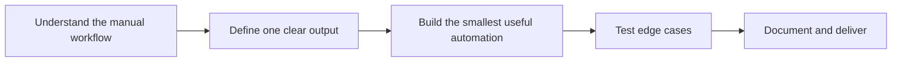

<div align="center">


<br/>

<a href="mailto:YOUR_EMAIL">
  
</a>

<a href="https://github.com/vinzicc?tab=repositories">
  
</a>

</div>

---

## About

I am a software builder focused on creating practical automation tools with **Python** and **Go**.

I build small, focused systems that reduce repetitive work, organize messy data, connect APIs, and turn manual workflows into reusable software.

My current focus is not building technology for its own sake. I prefer projects with a clear operational problem and a measurable output.

```text
Manual workflow → Automation → Structured output → Reusable system
```

---

## What I Build

* **Python automation** for repetitive operational workflows
* **Public web data extraction** into CSV or Excel
* **Data cleaning, normalization, and deduplication**
* **REST API integrations**
* **Internal dashboards and business utilities**
* **Lightweight backend tools** with Python or Go
* **AI-assisted classification and data processing**

---

## Current Offer

### Data Automation Sprint

A small, fixed-scope automation delivered for a specific workflow.

Typical examples:

* Extracting public website data into CSV or Excel
* Cleaning and standardizing spreadsheet data
* Removing duplicate or invalid records
* Connecting two services through APIs
* Automating recurring reports
* Building a lightweight internal data tool

**Typical deliverables:**

```text
✓ Working source code
✓ Structured CSV / Excel output
✓ Setup instructions
✓ One defined workflow
✓ Clear limitations and documentation
```

---

## Selected Projects

<table>
<tr>
<td width="50%" valign="top">

### Trace

A B2B lead research pipeline for collecting, organizing, scoring, and exporting public business information.

**Built with:**

`Python` `FastAPI` `React` `Supabase` `REST APIs`

**Core workflow:**

```text
Search
  ↓
Extract
  ↓
Normalize
  ↓
Score
  ↓
Export
```

[View repository →](https://github.com/vinzicc/trace)

</td>
<td width="50%" valign="top">

### ConvertScout

An internal lead opportunity and outreach workflow tool for organizing business data and identifying website conversion gaps.

**Built with:**

`Python` `FastAPI` `Next.js` `SQLite`

**Core workflow:**

```text
Import
  ↓
Clean
  ↓
Audit
  ↓
Review
  ↓
Export
```

[View repository →](https://github.com/vinzicc/convertscout)

</td>
</tr>
</table>

> Some projects are experimental builds used to explore practical business workflows. Documentation, reliability, and scope are improved progressively.

---

## Tools

<div align="left">


</div>

### Comfortable working with

```text
Python          Automation, data processing, backend utilities
Go              CLI tools and lightweight programs
FastAPI         APIs and automation backends
REST APIs       Service integrations and structured data exchange
Git / GitHub    Version control and project delivery
Docker          Reproducible development environments
Linux           Development and command-line workflows
```

---

## How I Approach Projects



I prefer:

* Clear scope over vague feature lists
* Working outputs over unnecessary complexity
* Small testable systems over oversized prototypes
* Honest limitations over exaggerated claims

---

## GitHub Activity

<div align="center">


</div>

---

## Contact

For fixed-scope automation work, send:

```text
1. The current manual workflow
2. Example input
3. Expected output
4. Approximate data volume
5. Required deadline
```

**Email:** `YOUR_EMAIL`

Communication can be handled asynchronously through text.

<div align="center">

<br/>


</div>
